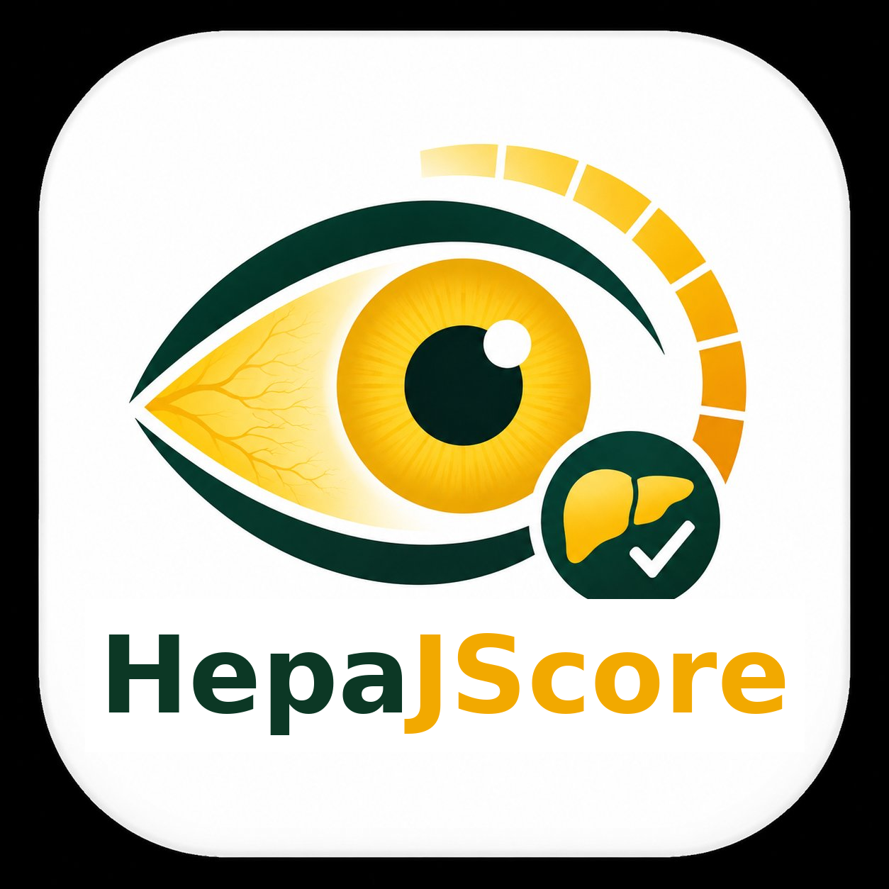
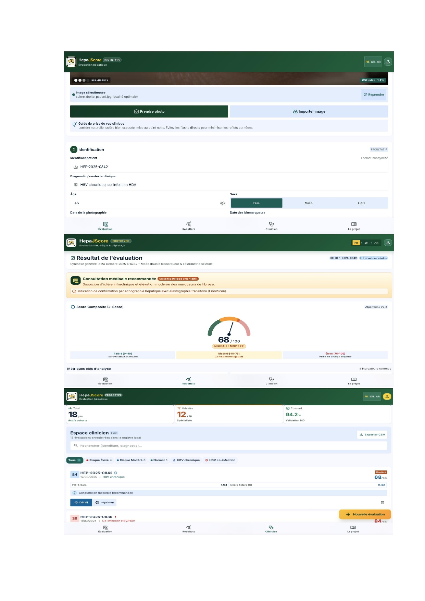
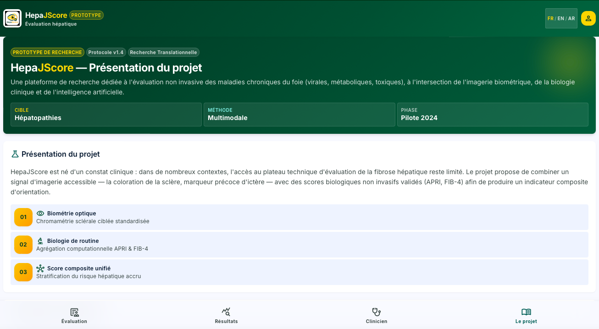

<p align="center">
  
</p>

<h1 align="center">HepaJScore</h1>

<p align="center">
  <b>Imaging-assisted liver assessment</b> — a trilingual (FR / EN / AR)
  web application with PWA support.
</p>

<p align="center">
  
  
  
  
  
</p>

HepaJScore is a research-grade decision-support prototype for
hepatologists. It pairs ML-based ocular landmark detection (MediaPipe
Face Mesh, with an OpenCV fallback) with validated non-invasive liver
scores — APRI and FIB-4 — to produce a composite jaundice score (J-score) from a sclera
photograph and a small set of clinical fields.

Developed during an Erasmus+ doctoral mobility fellowship, in
cooperation between the Université de Nouakchott, the Institut National
d'Hépato-Virologie (INHV) of Nouakchott, and the Universidad Politécnica
de Cartagena (UPCT), Spain.

> **Research prototype — not a certified medical device.** Not intended
> for clinical decision-making without further validation and
> regulatory oversight.

---

## Screenshots

<p align="center">
  
</p>

<p align="center">
  
</p>

---

## Overview

- **Ocular jaundice index (K)** — a focused peri-limbic colour analysis
  of the sclera, gated by mandatory eye detection so a score is never
  produced from an image with no visible eye.
- **APRI / FIB-4** — computed from standard biomarkers (AST, ALT,
  platelets, age).
- **Composite J-score** — combines the imaging signal with biology,
  banded via adaptive tertiles on the historical cohort with a
  clinical-rule override for edge cases.
- **Trilingual interface** — French, English, Arabic, with correct
  right-to-left layout.
- **PWA** — installable, offline-capable shell.
- **Clinician tooling** — admin area, PDF report generation, CSV
  export, rate limiting.

Full technical detail is in [`app.py`](./app.py) and
[`eye_detection.py`](./eye_detection.py).

---

## Stack

Flask · SQLite · MediaPipe · OpenCV · Pillow · NumPy · ReportLab ·
Gunicorn · Docker

---

## Getting started

Requires **Python 3.12**.

```bash
python3.12 -m venv venv && source venv/bin/activate
pip install -r requirements.txt

export SECRET_KEY="$(python3 -c 'import secrets;print(secrets.token_hex(32))')"
export ADMIN_USER="your-admin-user"
export ADMIN_PASS="a-strong-password"
python3 app.py
```

The app serves on `http://127.0.0.1:5000` (override with `PORT`).

### Docker

```bash
cat > .env <<EOF
SECRET_KEY=$(openssl rand -hex 32)
ADMIN_USER=your-admin-user
ADMIN_PASS=$(openssl rand -hex 12)
CONTACT_EMAIL=contact@hepajscore.org
EOF

docker compose up -d --build
curl http://localhost:8000/health
```

An HTTPS reverse proxy (nginx, Caddy) is required in front for PWA
installation and camera access on real devices.

### Platforms-as-a-service

A `Procfile` is included for Render / Railway / Fly.io — set
`SECRET_KEY`, `ADMIN_USER`, and `ADMIN_PASS` in the platform dashboard.

---

## Routes

| Route | Auth | Description |
|-------|------|-------------|
| `/` | none | Assessment form (trilingual) |
| `/about` | none | Project presentation page |
| `/submit` | none | Form submission |
| `/admin` | basic | Clinician area — submissions list |
| `/admin/<id>.json` | basic | Submission detail (JSON) |
| `/admin/print/<id>` | basic | Printable record |
| `/admin/delete/<id>?confirm=1` | basic | Delete a submission |
| `/export/csv` | basic | Full CSV export |
| `/pdfs/<file>` | none | Generated PDF reports |
| `/health` | none | JSON liveness probe |
| `/manifest.webmanifest`, `/service-worker.js` | none | PWA assets |

Language is set via `?lang=fr` / `?lang=en` / `?lang=ar`, or the
switcher in the header, and persists in a cookie.

---

## Configuration

| Variable | Default | Purpose |
|----------|---------|---------|
| `SECRET_KEY` | `change-me-in-prod` | Flask session signing |
| `ADMIN_USER` / `ADMIN_PASS` | `admin` / `admin` | Admin area & CSV export credentials |
| `CONTACT_EMAIL` | `contact@hepajscore.org` | Footer contact link |
| `CONSENT_REF` / `CONSENT_VERSION` | MR Ministry reference | Shown on the generated PDF report |
| `PORT` | `5000` (dev) / `8000` (Docker) | Server port |

All four must be set explicitly for any deployment reachable outside
`localhost`.

---

## Data & privacy

No patient data is stored in this repository. Uploaded photographs,
the SQLite database, generated PDFs, and logs are created at runtime
under `uploads/` and `data/`, both excluded from version control.

---

## Project structure

```
jscore_v18/
├── app.py                  # Flask backend
├── eye_detection.py        # MediaPipe / OpenCV eye & sclera detection
├── requirements.txt
├── Dockerfile
├── docker-compose.yml
├── Procfile
├── translations/
│   └── i18n.json           # FR / EN / AR strings
├── templates/
│   ├── base.html
│   ├── form.html
│   ├── about.html
│   ├── admin.html
│   └── print.html
├── static/
│   ├── styles.css
│   ├── app.js
│   ├── logo.png
│   └── screenshots/
├── uploads/                 # runtime, gitignored
└── data/                    # runtime, gitignored
```

---

## Limitations

- The J-score is a research heuristic, not a clinically validated
  score — no diagnostic claim is made.
- The jaundice index K relies on classical computer vision and is
  sensitive to lighting and framing; a learned segmentation model is
  planned as a successor.
- Basic auth on the admin area is a minimum-viable safeguard, not a
  production access-control system.
- The J-score formula carries over from v17 and has not yet been
  statistically derived or validated on a cohort.

---

## Acknowledgments

Developed by Mohamed Abdawa as part of an Erasmus+ doctoral mobility
fellowship, in cooperation between:

- Université de Nouakchott, Mauritania
- Institut National d'Hépato-Virologie (INHV), Nouakchott, Mauritania
- Universidad Politécnica de Cartagena (UPCT), Spain

---

## License

[MIT](./LICENSE) © 2026 Mohamed Abdawa.

Third-party dependencies (Flask, NumPy, Pillow, ReportLab, OpenCV,
MediaPipe, and others) are used under their own permissive licenses
via `pip` — see `requirements.txt`.
